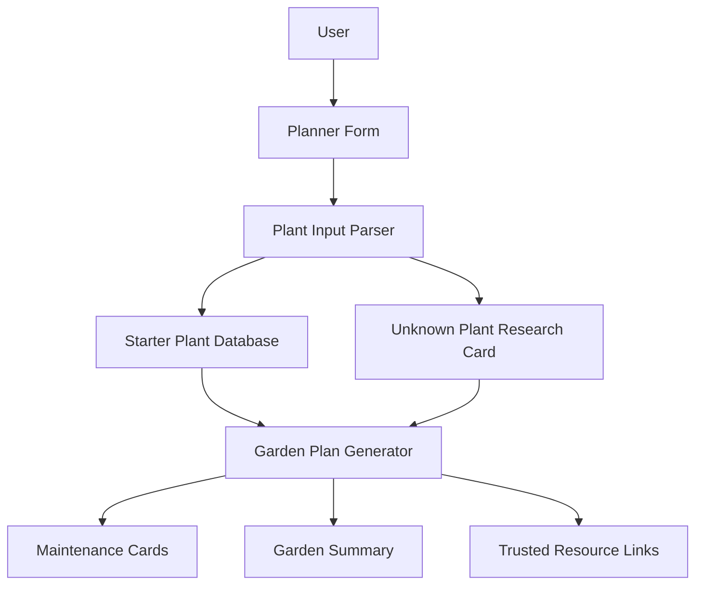

# Backyard Garden Planner

Backyard Garden Planner is a web app that helps home gardeners plan, plant, and maintain backyard vegetables, herbs, and flowers from a small amount of starting information.

The app begins with simple written inputs such as plant names and a house location, city, area, region, or ZIP code. It then turns those inputs into practical garden planning guidance, plant maintenance cards, care schedules, trusted resources, and visual references.

## Objective

The objective is to make backyard garden planning approachable for people who know what they want to grow but do not want to manually research every plant.

The app should help users answer:

- Where should each vegetable, herb, or flower go?
- Which plants need full sun, partial sun, or special placement?
- How often should each plant be watered?
- What fertilizer or soil care does each plant need?
- What maintenance tasks matter after planting?
- Which trusted resources should the user check for local planting dates and climate guidance?

The long-term product goal is a lightweight garden planning assistant that combines location-aware planting guidance, plant care cards, layout recommendations, and reminder workflows.

## Key Features

### Minimal Input Planning

Users can start with:

- Location, city/state, region, area, or ZIP code.
- A plain text list of plants.
- Optional sunlight and garden setup details.

Example input:

```text
Location: Austin, TX
Plants: tomato, basil, marigold, cucumber, zinnia
Sunlight: Mostly full sun
Garden type: Raised beds
```

### Plant Maintenance Cards

Each plant gets a card with:

- Plant image.
- Plant type.
- Sunlight needs.
- Spacing.
- Watering guidance.
- Fertilizer guidance.
- Planting timing.
- Harvest or bloom expectations.
- Placement notes.
- Key care tips.
- Common watch-outs.

### Garden-Level Summary

The app creates a garden-level plan that groups advice across all selected plants:

- Tall crops toward the back or north side.
- Smaller greens and herbs toward the front.
- Flowers along edges and pollinator zones.
- Plants grouped by watering and sunlight needs.
- Weekly care checklist for common maintenance tasks.

### Trusted Resource Links

The app links users to practical external resources for local verification:

- USDA Plant Hardiness Zone Map.
- Old Farmer's Almanac planting calendar.
- University extension watering guidance.
- University extension fertilizing guidance.
- Missouri Botanical Garden Plant Finder.

### Unknown Plant Handling

If a plant is not yet in the starter database, the app still creates a research card and tells the user which details to verify before planting.

### Saved Plans

Users can save generated plans in browser storage, reload a previous plan, and clear saved plans. This keeps the MVP local-first without requiring accounts or a backend.

### Printable Maintenance Cards

Users can print the current plan as care cards for offline reference while planting, watering, fertilizing, and harvesting.

## Benefits

- Reduces research time for new and casual gardeners.
- Turns a loose plant wish list into a usable plan.
- Helps prevent common mistakes such as overcrowding, overwatering, poor sunlight placement, and overfertilizing.
- Supports mixed backyard gardens with vegetables, flowers, and herbs.
- Encourages local verification for frost dates, climate zones, and region-specific planting guidance.
- Creates a foundation for future saved plans, reminders, and printable maintenance cards.

## Current Architecture

The current version is a React module app that runs in the browser from local files served over HTTP. It is also Vite-ready once npm dependencies are installed.



## File Structure

```text
garden-planner/
  AGENTS.md
  README.md
  index.html
  package.json
  styles.css
  scripts/
    serve.mjs
  src/
    App.js
    main.js
    data/
      plants.js
  docs/
    PROJECT_REQUIREMENTS.md
```

## Expected Outcome

The expected outcome is an interactive backyard garden planning tool where a user can enter a short plant list and immediately receive useful planning and maintenance guidance.

For the MVP, the app should:

- Generate a plan in one screen.
- Display attractive plant cards with relevant photos.
- Give clear watering and fertilizer guidance.
- Suggest practical placement rules.
- Link to trustworthy resources for local timing and climate verification.
- Work without requiring sign-up, accounts, or complex setup.
- Save recent plans locally in the browser.
- Print maintenance cards.

For future versions, the app should evolve into:

- A saved garden plan dashboard.
- A visual bed or container planner.
- Location-aware zone and frost date lookup.
- Calendar reminders.
- Printable care cards.
- Expanded plant database.
- Optional AI-assisted plant research and personalized recommendations.

## Expected User Experience

The first screen should feel like a working garden planning surface, not a marketing page.

The user experience should be:

- Fast: useful results after entering only location and plant names.
- Clear: cards and summaries are easy to scan.
- Practical: advice focuses on what to do before and after planting.
- Flexible: users can revise their plant list and regenerate.
- Grounded: local recommendations are framed as assumptions until verified with trusted resources.

Example experience:

1. User enters `Dallas, TX`.
2. User enters `tomato, basil, marigold, cucumber, lavender`.
3. App identifies vegetables, herbs, and flowers.
4. App recommends putting tomatoes and cucumbers in full sun, using a trellis for cucumbers, keeping lavender in a drier well-drained spot, and using marigolds as bed-edge flowers.
5. App provides watering, fertilizer, timing, and watch-out notes for each plant.
6. User checks linked planting calendar and USDA hardiness zone resources for local timing.

## Example Inputs And Outputs

### Example 1: Summer Vegetable Bed

Input:

```text
Location: Nashville, TN
Plants: tomato, pepper, basil, marigold
Garden type: Raised bed
Sunlight: Mostly full sun
```

Expected output:

- Tomato and pepper grouped as warm-season fruiting crops.
- Basil placed near tomatoes and peppers.
- Marigolds suggested for bed edges.
- Watering guidance emphasizes deep, consistent watering.
- Fertilizer guidance suggests compost at planting and later feeding during flowering or fruiting.

### Example 2: Mixed Flower And Herb Containers

Input:

```text
Location: Chicago, IL
Plants: lavender, petunia, basil, nasturtium
Garden type: Containers
Sunlight: Mixed yard conditions
```

Expected output:

- Lavender flagged for excellent drainage and lower water needs.
- Petunia flagged for regular container watering and light feeding.
- Basil flagged for warm weather and regular pinching.
- Nasturtium suggested for trailing container edges.

### Example 3: Unknown Plant

Input:

```text
Location: Portland, OR
Plants: tomato, calendula, shiso
```

Expected output:

- Tomato receives full starter guidance.
- Calendula and shiso receive research cards if they are not yet in the built-in database.
- User is prompted to verify spacing, sun, water, and planting timing from local extension or plant finder resources.

## Development Confirmation

This README defines the intended direction for the next development pass.

Before continuing development, please confirm or revise:

- App name.
- Preferred first garden type: raised beds, in-ground beds, containers, or all three.
- Whether guidance should default to organic-only methods.
- Preferred location input: ZIP code, city/state, or both.
- Whether the next feature should be saved plans, visual bed layout, calendar reminders, printable cards, or expanded plant data.

Once confirmed, development can continue from this baseline.

## Open Locally

PowerShell may block `npm.ps1` on some Windows systems. Use the command shim or the included helper instead of plain `npm` if you see an execution policy error.

Start the Vite dev server:

```powershell
cd "E:\Side Projects\garden-planner"
.\scripts\dev.cmd
```

Then open the local URL printed by Vite, usually:

```text
http://127.0.0.1:5173
```

You can also run npm through the `.cmd` shim directly:

```powershell
& "C:\Program Files\nodejs\npm.cmd" run dev
```

If dependencies ever need to be reinstalled:

```powershell
& "C:\Program Files\nodejs\npm.cmd" install
```

Plain `npm run dev` also works after changing PowerShell execution policy or when your shell resolves `npm.cmd` instead of `npm.ps1`.

For the current terminal only, this can help PowerShell find Node/npm:

```powershell
$env:Path = "C:\Program Files\nodejs;" + $env:Path
```

There is also a PowerShell helper, but it may be blocked by the same execution policy on stricter systems:

```powershell
.\scripts\dev.ps1
```

The fallback local static server also works with the bundled or system Node runtime:

```powershell
node scripts/serve.mjs
```

Then open:

```text
http://127.0.0.1:5177
```
